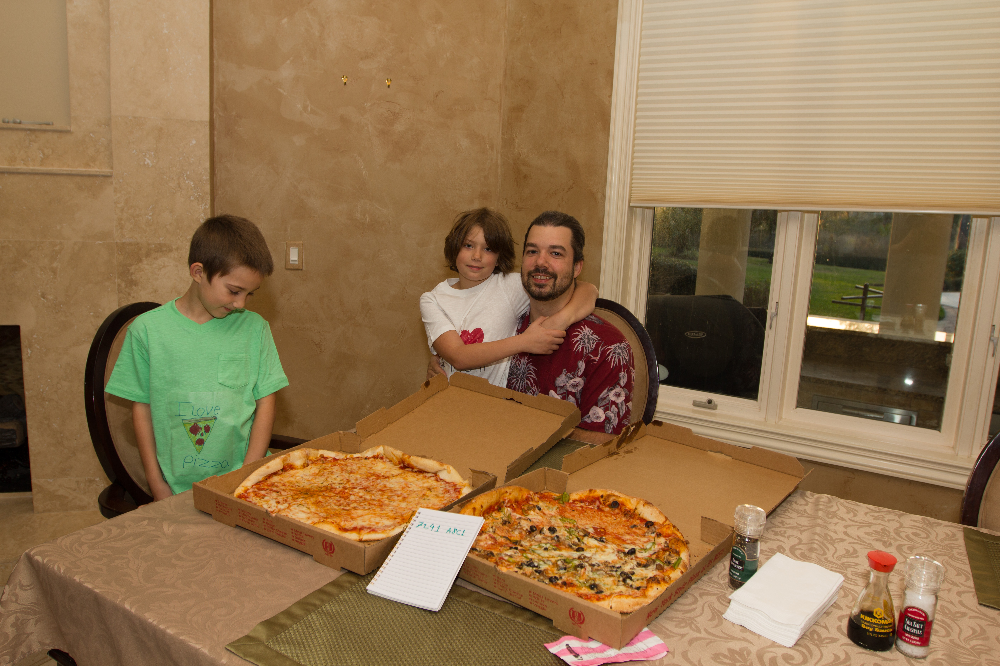

# Magyar Bitcoin projektek

\[[Bevezetés](./)\] - \[[Bitcoin tárca](tarca.md)\] - \[[Vásárlás](vasarlas.md)\] - \[[Privát kulcs kezelés](private_key_management.md)\] - \[[AntiFUD](antifud.md)\] - \[[Magyar Bitcoin projektek](magyarok.md)\] - \[[Bitcoin programozás](programozas.md)\]

## Magyar vonatkozású cégek és projektek

[https://zksnacks.com/](https://zksnacks.com/) [https://wasabiwallet.io/](https://wasabiwallet.io/)

[http://www.shinrai.co/](http://www.shinrai.co/) [https://www.facebook.com/shinrai.co/](https://www.facebook.com/shinrai.co/)

[http://www.drpd.hu/hu/](http://www.drpd.hu/hu/)

[https://blockchainbudapest.hu/](https://blockchainbudapest.hu/) 

Nick Szabo cypherpunk, kriptográfus és jogász. Az \`50-es években USA-ba vándorolt magyar szülők gyermeke. Nevéhez fűződik többek között a Bitcoin egyik alapjának tekinthető Bit Gold \(2005 december 29.\): [https://nakamotoinstitute.org/bit-gold/](https://nakamotoinstitute.org/bit-gold/) Angol nyelvű blogja: [https://unenumerated.blogspot.com/](https://unenumerated.blogspot.com/) Twitteren: [https://twitter.com/NickSzabo4](https://twitter.com/NickSzabo4)

Laszlo Hanyec  híres szereplője a Bitcoin világnak, ő vitte véghez az első fizikai termék vásárlást bitcoinnal 2010 május 22-én, 10000 bitcoinba került egy pizza\): [https://bitcointalk.org/index.php?topic=137.0](https://bitcointalk.org/index.php?topic=137.0) A legtöbben csak Bitcoin Pizza Guy-ként ismerik.

2018 február 25-én újra Bitcoin történelmet írt az első fizikai termékért küldött Lightning Network tranzakcióval: [https://lists.linuxfoundation.org/pipermail/lightning-dev/2018-February/001044.html](https://lists.linuxfoundation.org/pipermail/lightning-dev/2018-February/001044.html) 

