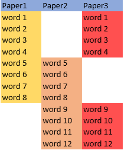

# Privát kulcs kezelés 

\[[Bevezetés](./)\] - \[[Bitcoin tárca](tarca.md)\] - \[[Vásárlás](vasarlas.md)\] - \[[Privát kulcs kezelés](private_key_management.md)\] - \[[AntiFUD](antifud.md)\] - \[[Magyar Bitcoin projektek](magyarok.md)\] - \[[Bitcoin programozás](programozas.md)\]

## ["Ha birtoklod a privát kulcsot akkor az a te bitcoinod, ha nem birtoklod, nem a te bitcoinod." \(Andreas Antonopoulos videó\)](https://www.youtube.com/watch?v=vt-zXEsJ61U)

Telefon, számítógép vagy hardver tárca elvesztése esetén az egyetlen esély bitcoinunk elérésére, ha a tárca generálásakor leírt seedből visszaállítjuk privát kulcsokat. Ez a seed, a megjegyzés illetve tárolás egyszerűsítése véget, 12-24 angol szóból áll amelyek közel random módon kerülnek kiválasztásra ebből a listából: [https://github.com/bitcoin/bips/blob/master/bip-0039/english.txt](https://github.com/bitcoin/bips/blob/master/bip-0039/english.txt) A szavakat az első négy karakter meghatározza, akár a szavak első négy betűjét is elég leírni.

Ezt seedet ne elektronikusan tároljuk. Kis érték esetén egy papírlapon leírva biztonságos helyen tárolandó. A környezeti hatások \(elázás, tűz, stb.\) mellett attól is meg kell óvnunk, hogy mások a tudtunk nélkül hozzáférjenek. **Bárki, aki tudja ezt a seedet hozzáférhet a rajta tárolt bitcoinhoz.**

Papírlap helyett használhatunk fémlapot, amibe beleütve, vagy gravírozva a szavakat sokkal ellenállóbb lesz a környezeti hatásoknak. Egy borítékban leragasztva, esetleg számozott, hologramos biztonsági matricával védve elrejthetjük a kíváncsi szemek elől.

# A privát kulcs (seed) biztonságos tárolása

A 24 szót 2/3 - 2/3 - 2/3 arányban felosztva (az ábrán látható módon) írjuk le 3 külön papír- vagy fémlapra:  
  

12 szó esetében:  
  

Így egy lap nem lesz elegendő a tárca visszaállításához, de bármelyik kettőből menni fog. A lapokat a fentebb leírt módon egy egyedi matricával leragasztott borítékban tároljuk 3 földrajzilag elkülönülő helyen.

Időnként érdemes meggyőződni a borítékok érintetlenségéről, mert a seed 2/3-ának birtokában elvileg már lehetséges a maradék 1 harmad próbálgatással való megtalálása. Ehhez persze egy nagyteljesítményű számítógép \(pl. egy GPU rig\) és jelentős szaktudás szükséges. Ennek esélyét és az így tárolt maximális összeget mindenkinek magának kell fontolóra vennie. A módszer leírása angolul: [https://github.com/JWWeatherman/how\_to\_store\_bitcoin](https://github.com/JWWeatherman/how_to_store_bitcoin)

# Privát kulcs generálás offline (cold storage)

Ha biztosak akarunk lenni abban, hogy privát kulcsunkhoz senkinek sincs hozzáférése a tudtunk nélkül, olyan módon kell létre hoznunk, hogy nem is érintkezzen internet kapcsolattal rendelkező géppel.
Ennek egyik módja egy hardver tárca használata, aminek a lényege, ha tárcába épített hardveres titkosító chip végzi a tranzakciók aláírását, így a benne tárolt privát kulcs el van szigeteleve a kapcsolódott számítógéptől.
Ha nem áll rendelkezésünkre egy hardver tárca, vagy csak senkiben sem akarunk bízni egy offline számítógép segítségével is elvégezhető a feladat:

1. Írd a Tails linux distrot egy DVD-re (USB pendrive-al is lehetséges): https://tails.boum.org/install/dvd-download/index.en.html
3. Húzd ki a vezetékes internetkapcsolatot (LAN kábelt), kapcsold ki a wifi kártyát és a bluetooth-t (ha lehet, szereld ki). 
4. Indítsd a számítógépet a DVD-ről
5. Csatolj egy USB pendrive-ot. Formázzuk a Tailsben. 
6. Hozz létre a pendrive-on egy .txt fáljt 
7. Indítsd el az Electrum walletet
8. Hozz létre egy tárcát az Electrumban:
    * Nevezd el a tárca információkat tároló fájlt 
    * Standard wallet  
    * Create new seed  
    * SegWit
    * Írd le a random generált 12 szót  
    * Írd be a szavakat ezzel ellenőrizve az előző lépést
    * A tárca file-t titkosítható egy jelszóval (akkor lenne szükséges, ha megtartanánk a fájlt)  
    * View menu - Show Addresses
    * Jobb kattintással egyenként másold ki az első pár címet (bc1...) és illeszd a 3-as pontban létrehozott .txt fájlba. 
    * Wallet menu - Information  
    * Másold ki a Master public key-t (zpub...) és illeszd a .txt fájl végére (ez a tárca nyílvános, csak olvasási engedéllyel rendelkező kulcsa, segítségével több címet is generálhatunk)
9. Ellenőrizd, hogy:
    * a seed jól olvashatóan van leírva. Gondoskodj a megfelelő tárolásról.
    * Az USB pendrive tartalmazza a .txt fájlt a címekkel és a nyílvános  kulccsal
10. Kapcsold ki a számítógépet.
11. A tárca tartalmát több szoftverből figyelheted. A nyílvános kulcsot (master public key) importálhatad a szokásos operációs rendszereden futó Electrumba vagy mobilon a Sentinel app-ba. Így a coin-ok elköltésére, továbbküldésére nem lesz lehetőség, de bármikor ellenőrizheted a tárca tartalmát.
A **coinok küldése csak a privát kulcs (seed) importálásával lehetséges**. Kezeld a 12 szót ennek megfelelően.

### Továbbiak

* [https://www.proofofkeys.com/](https://www.proofofkeys.com/)

* A privát kulcs biztonságos többfelé bontására alkalmas kriprográfiai módszer: [https://en.wikipedia.org/wiki/Shamir%27s_Secret_Sharing](https://en.wikipedia.org/wiki/Shamir%27s_Secret_Sharing)

* Biztonságos és privát bitcoin tárolási módszerek lépésről-lépésre: https://github.com/DriftwoodPalace/guides

* Nagy érték tárolására kifejlesztett maximálisan paranoid módszer angolul:  
[https://glacierprotocol.org/](https://glacierprotocol.org/)

* Multisig megoldások:  
https://www.unchained-capital.com/vaults/  
[https://keys.casa/](https://keys.casa/)