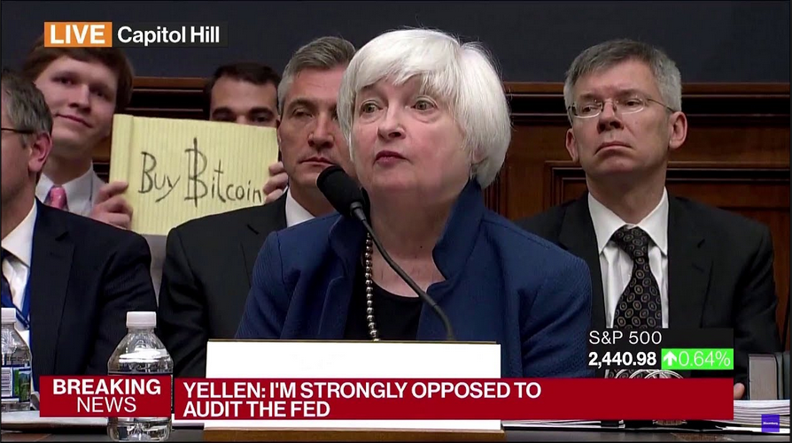
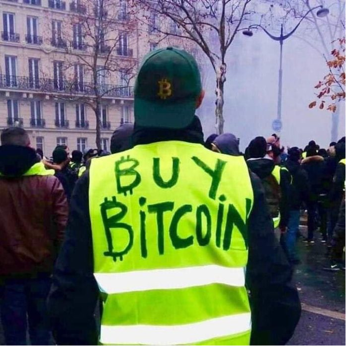

# Vásárlás

\[[Bevezetés](./)\] - \[[Bitcoin tárca](tarca.md)\] - \[[Vásárlás](vasarlas.md)\] - \[[Privát kulcs kezelés](private_key_management.md)\] - \[[AntiFUD](antifud.md)\] - \[[Magyar Bitcoin projektek](magyarok.md)\] - \[[Bitcoin programozás](programozas.md)\]

Szeretnéd a kormány által kibocsátott \(fiat\) pénzedet igazi, kemény bitcoinra váltani? Részletek itt.

Forintban sajnos egyelőre nagyon kicsi a likviditás így EUR/GBP/HUF váltáshoz és mozgatáshoz érdemes egy [Revolut](https://www.revolut.com) accountot és kártyát szerezni. Ingyenes és nemzetközi utazáshoz is hasznos.

Pár fogalmat érdemes ismerni az exchange-ekkel kapcsolatban:

KYC: Know Your Customer  
AML: Anti-Money Laundering

Ez a két rövidítés az USA-ból származó törvényi követelményekre utal, ami pénz kezelés esetében a kereskedők és ügyfelek adatainak rögzítését teszi kötelezővé.

Ezzel a szabályozással minden fiat pénzt tároló \(custodial\) bitcoin váltónak együtt kell működnie. A különböző mértékben decentralizált szervezetek megkerülik ezt a problémát úgy, hogy peer-to-peer kereskedelemre adnak lehetőséget.

## [Bittr](https://www.getbittr.com/) - a legyegyszerűbb bitcoin vásárlási mód

Twitteren: https://twitter.com/GetBittr. Az alapító: https://twitter.com/watermaniak

A vásárlás lépései: 

* Bitcoin tárca generálás - [részletek](tarca.md)
* [Regisztráció](https://getbittr.com/save-bitcoin) emaillel ás telefonszámmal (bármelyik európai országból)
* Euro utalás a regisztráció során megadott számlaszám és közlemény használatával.
* Pár órába kerül amíg az utalásnak megfelelő bitcoin összeg megjelenik a tárcában.
* Ajánlott egy kisebb összegű, rendszeres, automatikus utalás beállítása a bitcoin gyakori árváltozásának ellensúlyozására.

Euro utalás forint alapú bankszámláról banktól függően jelentős pluszköltséggel jár.  
Ajánlott egy ingyenes Euro számla nyitása: 
* [Bunq](https://www.bunq.com/) - Holland online bank  
Ruben meghívójával a kártya egyszeri 10 eurós díja visszajár: https://bunq.com/invite/RFWaterman

* [N26](https://n26.com/en-eu/) - Népszerű német online bank

* Forint euróra váltására a [Transferwise](https://transferwise.com/) vagy [Revolut](https://www.revolut.com) a legolcsóbb mód.

Díjak:
* A Bittr szolgáltatási díja fix 1.5%
* Revoluttal a banki nyitvatartési időben havi 5000 euró banki középárfolyamon plusz plusz díj nélkül váltható: https://www.revolut.com/legal/fees/
* A Transferwise HUF-EUR váltási díja 1-2%:  https://transferwise.com/pricing/#pricing-page-calculator-anchor

## Non-custodial exchange-k

Ezek nem tárolnak pénzt számodra, tehát a \(fiat\) pénzt közvetlenül az eladónak kell eljuttatni,  de **a privát kulcsok pedig végig a tulajdonodban maradnak**. Automatikus letét \(escrow\) rendszerrel felelnek a biztonságért. Általában lassabbak és valamennyivel drágábbak az adatokat és pénzt tároló exchangeknél.

A leginkább titkos és megbízható decentralizált váltó a [Bisq](https://bisq.network/).
Érdemes regisztrálni és fizetési módokat hozzáadni, mert a kereskedési limitek a regisztrációt követő hetekben fokozatosan növekednek.

Központi szerverrel rendelkező peer-to-peer exchange, ami szintén nem kötött személyes adatok megadásához: [HodlHodl](https://hodlhodl.com/)

## Custodial exchange avagy bitcoin-bank

Ha nagyobb tételben akarsz vásárolni és nem zavar a személyes adataid kiszivárgása az egyik legnépszerűbb exchange a [Coinbase.com](https://www.coinbase.com/). EUR, GBP, USD valutákban működik. Hitelkártyával akár azonnali vásárlást enged 2-4%-os díjért, de inkább utalni érdemes az alacsonyabb díjak érdekében. Ugyanazzal a regisztrációval a [https://pro.coinbase.com/](https://pro.coinbase.com/) felülettel érdemes megismerkedni, mert ott alacsonyabb díjjal lehet vásárolni. Sőt a BTC kiküldésekor jelentkező mining/network fee-t is állják.

## A vásárlás menete \(LIMIT BUY\)

[https://pro.coinbase.com/](https://pro.coinbase.com/) regisztráció és bejelentkezés.  
`Select Market:` `BTC - EUR` &gt;  
`DEPOSIT` &gt;  
`Select currency` &gt;  
`Euro`  
Az itt megjelent IBAN szamlaszámra lehet utalni. **Fontos a megadott közleményt feltüntetni!** 2-5 napba telik amíg megérkezik az összeg és az `EUR` mezőben látható lesz.

Ezután fentről lefelé:  
`BUY` opció &gt;  
`LIMIT` &gt;  
`Limit Price`: a felül olvasható `Last Trade price` beírása egy jó választás &gt;  
`Amount`: a beállított áron \(vagy az alatt\) vásárlandó BTC mennyisége. `Max` vagy kevesebb. &gt;  
`Post Only` &gt;  
**utolsó ellenőrzés** &gt;  
`PLACE BUY ORDER`.  
Ha elég magas árat adtunk meg pillanatok alatt végbemegy a vásárlás és fent megjelenik a vásárolt BTC összege. Ha nem így lenne, érdemes várni, az ár naponta is 100 eurókat ingadozik, így hamar eléri majd a limitet.

Ezután erősen ajánlott a vásárolt BTC-t kiküldeni a saját kontrollunk alatt álló tárcába:  
`WITHDRAW` &gt;  
`Select currency` &gt;  
`Bitcoin` &gt;  
`Destination`: a bitcoin walletünk által adott receive address&gt;  
`Amount`: `Max`vagy kevesebb&gt;  
`WITHDRAW BTC` &gt;  
ellenőrzés és a beállított jelszó és 2FA megadása

Pár órába is telhet amíg a Coinbase elküldi a tranzakciót, de akkor a tárcában azonnal megjelenik az összeg. Onnan tovább majd akkor mozgathatjuk, ha belekerült egy blokkba és a blockchainen regisztrálódott a helyzete. Ahogy további blokkok épülnek rá egyre biztosabbak lehetünk benne, hogy elkobozhatatlan pénzre tettünk szert.

## 

HODL: híres mém ami arra utal, hogy az "egyszerű" ember nem tudja jól időzíteni a vételt és eladást így a legjobban úgy jár, ha nem is próbálkozik a kereskedéssel, hanem csak tárolja a bitcoint \(holdból részegen elírva lett HODL\) [https://bitcointalk.org/index.php?topic=375643.0](https://bitcointalk.org/index.php?topic=375643.0)

Egy jól sikerült fotóbomba az amerikai központi bank \(Federal Reserve\) elnöknőjének meghallgatásán \(2017. július 12.\):  

Párizs, 2018. december 1:  

